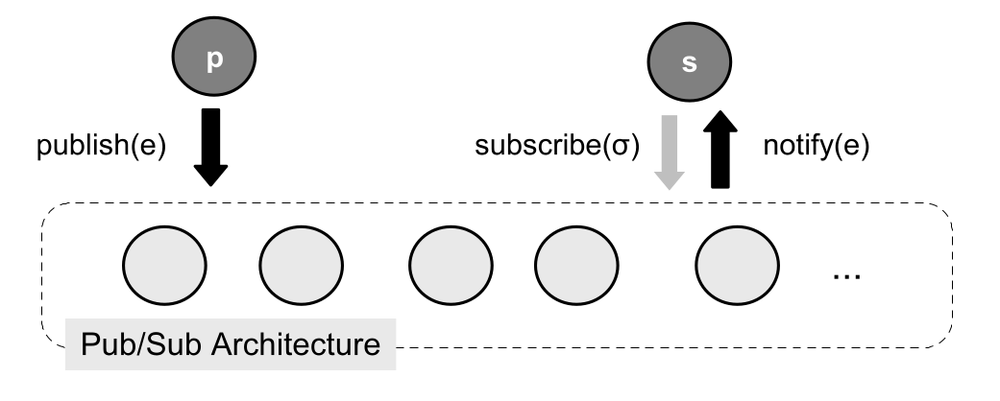
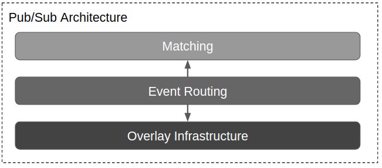

# Hive-Map

Modular Pub-Sub Framework

## Introduction
The [pub-sub pattern](https://en.wikipedia.org/wiki/Publish%E2%80%93subscribe_pattern) is generic, but it is used to tackle specific problems. These problems have specific requirements and contexts. There is no one-size-fits-all implementation. For example, pub-sub systems that use [mobile-adhoc-networks](https://en.wikipedia.org/wiki/Wireless_ad_hoc_network) will have different implementations than pub-sub systems that use the [internet](https://en.wikipedia.org/wiki/Internet). Past approaches tackle a subset of pub-sub problems and put them into a framework [1]. Hive-Map takes a different approach. The Hive-Map framework abstracts the pub-sub pattern enough to encopass the full problem set. This abstraction allows Hive-Map components to be reimplemented, tested, benchmarked and shared easily. The framework user picks the modules that best suits their problem.        

## Background

### Pub-Sub Pattern

The power of the publisher-subscriber model comes from decoupling the producers of information from the consumers. In any pub-sub architecture, there are four main components: events, subscriptions, publishers and subscribers.

|Component| Description|
|------------|----------|
|Event       | piece of information that happened in the system|
|Subscription| expressed interest in a subset of possible events|
|Publisher   | publishes events|
|Subscriber  | notified of published events that match its subscription|

*The figure above shows the typical interaction in any pub-sub system. The symbol e is an event. The symbol &#963; is a subscription. The node *P* is a publisher. The node *S* is a subscriber [1].*

Imagine a scenario about weather. In this system, events are descriptions of weather in certain locations: "It's sunny in LA" or "It's rainy in Boston". Subscriptions would express interest in these locations: "I'm interested in LA's weather". A subscriber could use a subscription to be notified about certain weather events. 

The important detail, in the weather example, is that subscribers are completely decoupled from publishers. A subscriber wants to be notified about events that match its subscription; it is indifferent to the source of the event. A publisher publishes events; it is indifferent to the subscribers that receive the event. A decoupled system allows publishers and subscribers to scale independently: there can be a million subscribers, and the behavior of a publisher does not change.

### Abstraction

The components described above are the interface to any pub-sub problem, but more machinery can be abstracted. The pub-sub survey paper by Roberto Baldoni offers a [stack-based](https://en.wikipedia.org/wiki/Solution_stack) architecture [1]. The layers in the stack are illustrated below. 

The overlay infrastructure is an application level network responsible for the connections between participants. The event routing layer is responsible for getting published events to all interested subscribers; it leverages the overlay infrastructure to get events to appropriate subscriptions. The matching layer determines if a subscription is interested in an event.

## Components

### Matching

### Routing

### Communication

## Libraries

[Python3 (not-up-to-date)](https://github.com/gregjhansell97/hive-map-python-3/)

[Embedded Cpp (not-up-to-date)](https://github.com/gregjhansell97/hive-map-cpp/)

## Related Work

### ROS
Overview of ros

### RobotRaconteur
Overview of RR

### OTHERS
Need to find more pubsub systems and discuss them

## Authors
Greg Hansell: gregjhansell@gmail.com

## Citations

[1] distributed-event-routing paper

[2] event-systems-survey paper

[3] many-pub-sub-faces paper

[4] striving-for-versatility paper
