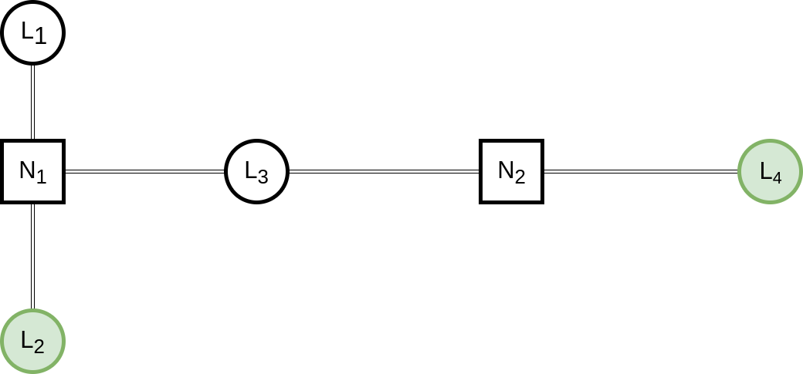

# Hive-Map

Communication Agnostic Distributed Pub-Sub Network

## Description

**Hive-map provides a framework to facilitate message publishing between user 
defined locations.**

A **location** is an entity that represents a point on a symbolic map. Locations
are connected to one another through **channels**. Channels are the means in 
which locations communicate. Locations publish messages to **destinations**. A 
destination is another location on the symbolic map. A location has subscribers 
to various message types.

In the diagram above, *L2* publishes a message to *L4*. 
Upon receiving the message, *L4* will deliver the message to the 
appropriate subscribers; an appropriate subscriber subscribes to that message 
type. Subscribers are not part of the diagram: they are language dependent 
programming constructs.

**Locations with matching destinations can work together to get their messages
to those destinations.**

The user of the framework describes the communication channels, available 
locations, and types of messages. Hive-map routes published messages to 
destinations. 

## Goal

A framework to perform distributed routing of subscribable messages from 
locations to destinations.

## Components

### Message
A message is a chunk of data that contains attributes. It is the content of the
distributed communication network. There is more than one type of message. The 
developer defines message types appropriate for their map.

#### Properties
- A message is serializable
- A message is immutable once published 
- A message contains information about the type of message and publisher
- A message type has a fixed storage size

### Channel
Messages are sent through channels. A channel is the medium used to move 
messages from one end-point to another. An end-point is a spot on the channel 
to read and write data. The developer defines the channels by defining read 
and write operations for each channel.

#### Properties
- Channel is comprised of 0 or more end-points
- A message sent from one end-point to another gets dropped with a certain 
probability
- Either the whole message makes it through to the end-point or none of it does

### Location
A point in the user defined map. Locations are where messages are published from 
and delivered to. Locations communicate to other locations through channels.
Locations are used by developers to interact with the rest of the map. A 
developer can create subscriptions to message types for a location. A developer 
gets destination instances from a location.

#### Properties
- Every location is represented uniquely by a number
- Only one instance of a location exists at a time 
- If a message is delivered to one subscribe then all subscribers receive 
message

### Destination
Destination is a location that is targeted to receive published messages.

## Examples

### Library Occupancy Detection

The goal of library occupancy detection is to get occupancy information from 
rooms in the library to a database. The locations in this library are:
*room 1*, *room 2* and *occupancy database*. The messages being published are
*occupancy* messages. A particular room publishes *occupancy* messages 
to the *occupancy database*. The *occupancy database* has subscribers to
*occupancy* messages. The locations communicate through channels configured
to write and read over radio.

## Libraries
[C](https://github.com/gregjhansell97/hive-map-c/)  

[Python3](https://github.com/gregjhansell97/hive-map-python-3/)

[Cpp](https://github.com/gregjhansell97/hive-map-cpp/)  
  
